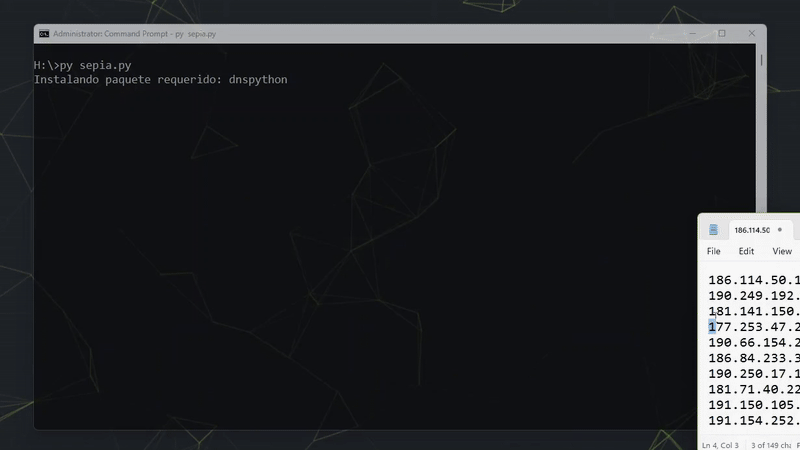

# Crazy Sepia Tool v1.0

> **Desarrollado por [@eyvr17](https://x.com/eyvr17)**  
> Herramienta ofensiva para reconocimiento, escaneo y análisis básico de redes.  
> Inspirada en entornos de pruebas reales y ambientes de ciberseguridad ofensiva.

---


---

## Descripción

**Crazy Sepia Tool** es una suite CLI escrita en Python para tareas rápidas de recopilación de información y análisis de redes. Incluye módulos OSINT, escaneo de puertos, resolución DNS, ping sweep, entre otros.  
Pensada para escenarios de laboratorio, captura la esencia de herramientas *minimalistas y potentes* utilizadas por analistas de ciberseguridad y entusiastas del hacking ético.

---

## Funcionalidades

| Módulo                   | Descripción                                                |
|--------------------------|------------------------------------------------------------|
| Geolocalización IP       | Consulta `ipinfo.io` para obtener ubicación e ISP.         |
| Consultas DNS            | Registros A, MX y NS mediante `dnspython`.                |
| Escaneo básico de puertos| Escaneo con sockets, rápido pero limitado.                |
| Escaneo con Nmap         | Integración con Nmap (instalación automática).            |
| Ping Sweep local         | Descubre hosts activos en red local.                      |
| MAC por ARP              | Consulta ARP para obtener MAC de IP local.                |
| VirusTotal               | Consulta rápida (requiere API key personal).              |
| Submenú OSINT            | Herramientas de reconocimiento pasivo.                    |
| Enlaces de DDoS públicos | Recursos para pruebas controladas y educativas.           |
| Módulo Wi-Fi (WIP)       | Espacio reservado para futuras funciones inalámbricas.    |

---

## Instalación

### 1. Clonar el repositorio

```bash
git clone https://github.com/eyvr17/sepia.git
cd sepia
```

### 2. Ejecutar como administrador (Windows)

```bash
python sepia.py
```
> 📌 Requiere permisos de administrador en Windows para algunas funciones (como ping sweep o acceso ARP).

### 3. Dependencias

Se instalan automáticamente al ejecutar el script si no están presentes:
- `requests`
- `dnspython`

También se descarga e instala Nmap automáticamente si no se encuentra en el sistema.

---

## Demo





---

## Estructura del Proyecto

```
crazy-sepia-tool/
├── sepia.py        # Script principal
├── assets/
│   └── sepia.gif         # Archivos GIF incluidos en el README
│   └── mrrobot.gif
└── requirements.txt      # (opcional, para pip install)
```

---

## Consideraciones Legales

Esta herramienta está destinada exclusivamente para aprendizaje, pruebas internas y entornos controlados.  
No está permitido su uso en sistemas de terceros sin autorización explícita.  
El autor no se hace responsable por cualquier mal uso de este software.

---

## Estado del Proyecto

- [x] Módulos OSINT básicos
- [x] Integración con Nmap
- [x] Soporte para VirusTotal
- [x] Funciones locales de red
- [ ] Soporte Wi-Fi avanzado
- [ ] Reportes HTML / PDF
- [ ] API REST (futuro)

---

## Contacto

Desarrollado por [@eyvr17](https://x.com/eyvr17)